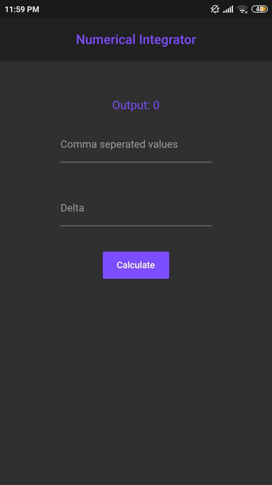
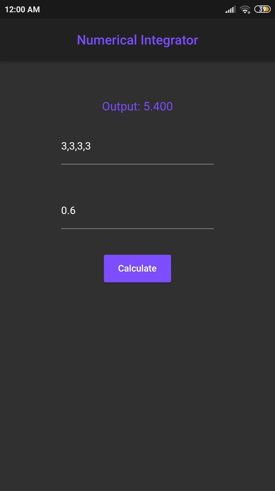

# Numerical Integrator

This app helps students to calculate the numerical integration given different points easily. It uses two methods to compute the approximate area under the points.
1. Trapezoidal Rule [Tap to know more](https://en.wikipedia.org/wiki/Trapezoidal_rule)
2. Simpson's Rule [Tap to know more](https://en.wikipedia.org/wiki/Simpson%27s_rule)

<table>
  <tr>
    <td>First Screen</td>
     <td>Results</td>
  </tr>
  <tr>
    <td></td>
    <td></td>
  </tr>
 </table>

## Getting Started

A few resources to get you started if you too want to make cool lookin apps:

- [Lab: Write your first Flutter app](https://flutter.dev/docs/get-started/codelab)
- [Cookbook: Useful Flutter samples](https://flutter.dev/docs/cookbook)

For help getting started with Flutter, view the
[online documentation](https://flutter.dev/docs), which offers tutorials,
samples, guidance on mobile development, and a full API reference.
